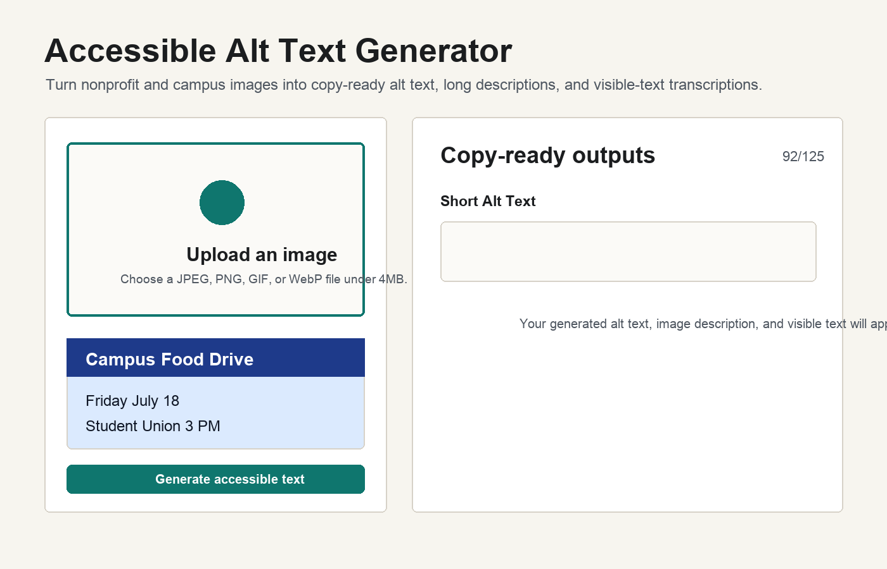
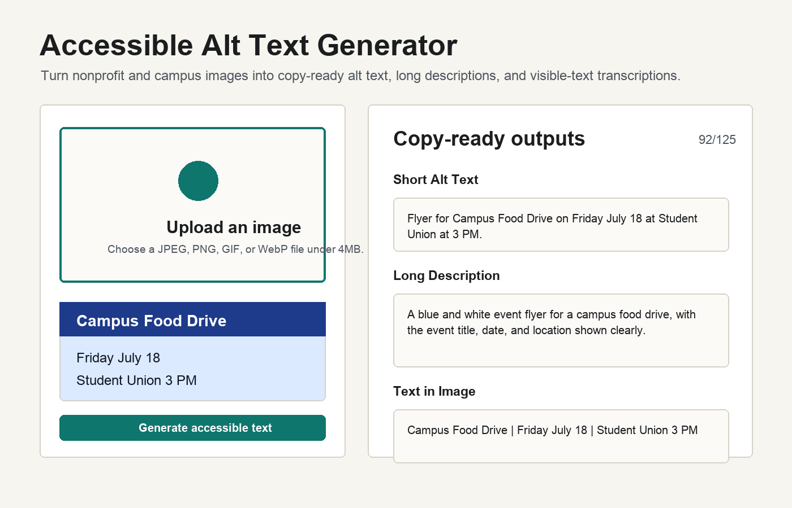

# Accessible Alt Text Generator

Accessible Alt Text Generator helps small nonprofits, campus clubs, and volunteer groups turn images into copy-ready accessibility text.





## What This Tool Does

This is a stateless Next.js app for generating accessible descriptions from one uploaded image at a time. A user uploads a campus event photo, flyer, screenshot, or object photo, then the app returns three outputs:

- **Short Alt Text**: concise text for an `alt=""` attribute.
- **Long Description**: a fuller description for a caption or extended description.
- **Text in Image**: visible text transcribed from flyers, posters, signs, screenshots, or graphics.

The app does not store images, generated text, accounts, or history. Each upload is processed as one independent request.

## WCAG 1.1.1 Guidance

[WCAG 1.1.1 Non-text Content](https://www.w3.org/WAI/WCAG21/Understanding/non-text-content.html) says that meaningful non-text content should have a text alternative that serves the same purpose. In my own words, "equivalent purpose" means that if someone cannot see the image, the text should give them the same important information or function they would have gotten from seeing it.

For example, a flyer is not just "a blue poster." Its purpose is usually the event title, date, time, location, and call to action. A chart is not just "a bar chart." Its purpose is the trend or comparison the viewer is supposed to understand.

This app enforces a 125-character limit for the short alt text because that is a common screen reader and publishing convention, not a WCAG requirement. WCAG 1.1.1 itself does not set a character limit.

## Before-and-After Examples

These examples use the validation images in `outputs/validation-images`. The "Before" column is intentionally empty or filename-like because that is the accessibility problem this project is meant to solve.

| Image | Before | Generated Alt Text |
| --- | --- | --- |
| Campus club fair graphic | `alt=""` | UW Club Fair graphic showing students visiting club tables on a campus lawn. |
| Campus food drive flyer | `IMG_4471.jpg` | Flyer for Campus Food Drive with donation details and event information. |
| Club signups chart screenshot | No alt text | Bar chart showing club signups increasing from January to April. |

Validation details are in [outputs/week4_validation_results.xlsx](outputs/week4_validation_results.xlsx), and prompt iteration notes are in [PROMPT_LOG.md](PROMPT_LOG.md).

## Local Development

Install dependencies:

```bash
npm install
```

Create a local environment file:

```bash
cp .env.example .env.local
```

Get a Groq API key:

1. Go to [console.groq.com](https://console.groq.com).
2. Sign up or log in.
3. Open **API Keys**.
4. Generate a new key.
5. Add it to `.env.local`:

```bash
GROQ_API_KEY=your_key_here
```

Run the app:

```bash
npm run dev
```

Open:

```text
http://localhost:3000
```

## Configuration

Set these variables locally in `.env.local` and in Vercel project settings. Do not commit real API keys to GitHub.

```bash
VISION_PROVIDER=groq
GROQ_API_KEY=your_key_here
GROQ_VISION_MODEL=qwen/qwen3.6-27b
USE_MOCK=false
```

`GROQ_API_KEY` is the private server-side key used by the API route. It is only read in server code and should never be prefixed with `NEXT_PUBLIC_`.

`GROQ_VISION_MODEL` controls the Groq vision model. This project uses `qwen/qwen3.6-27b`, verified on Groq's supported model list on July 23, 2026. If image generation stops working with a model error, check [Groq's supported models page](https://console.groq.com/docs/models) and update this variable to a current model with image/OCR capability.

`USE_MOCK=true` runs the app with fixture data and does not call Groq. This is useful for testing the UI, copy buttons, loading states, and 125-character truncation without using API quota or needing a key.

For deployment, add the environment variables in the Vercel dashboard under **Settings → Environment Variables**, then redeploy. `.env.local` is listed in `.gitignore`, so local secrets stay off GitHub.
